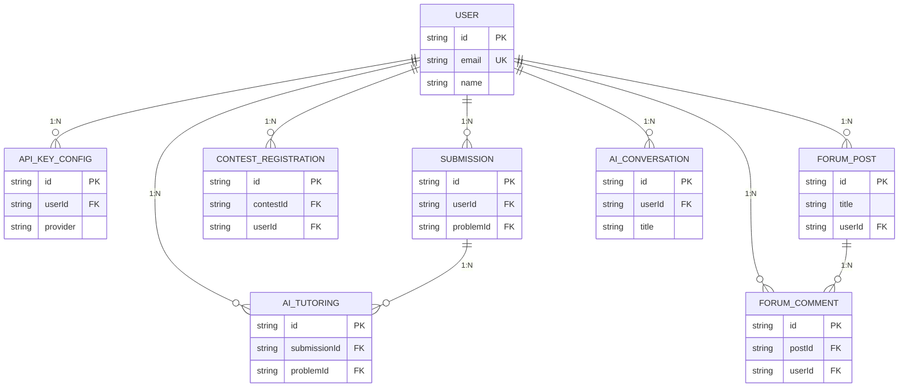
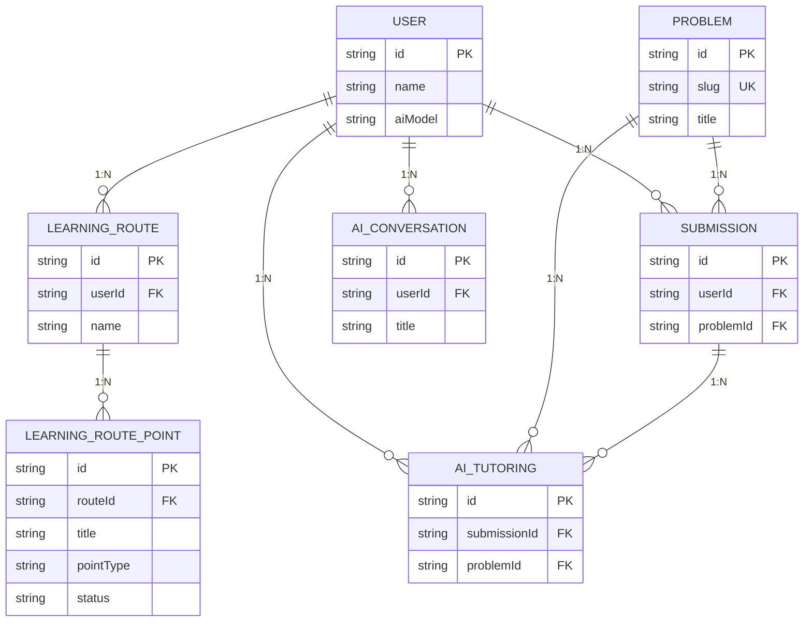
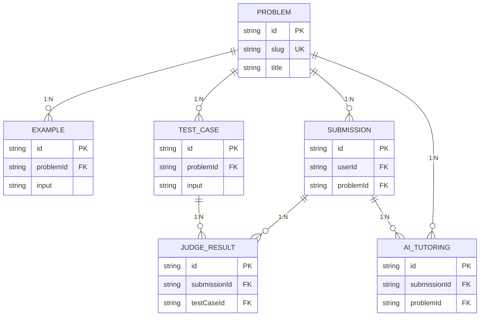
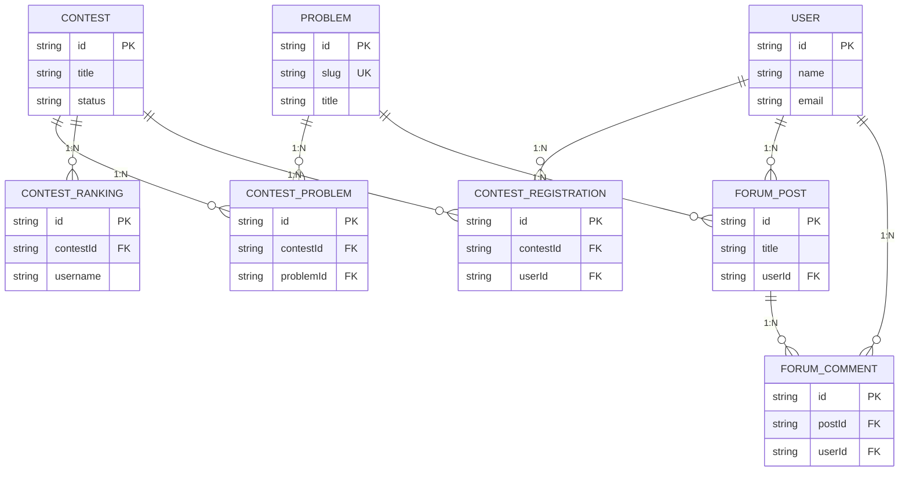

# 用户信息

说明：下方 Mermaid ER 图保留连接符号以保证渲染，但关系含义已统一用 1:N 标识。

# AI辅导和学习路线

# 题库

# 比赛和论坛

用户信息设计说明

这张图描述的是系统中以用户为中心的核心数据关系，重点展示账号身份、AI 配置、提交记录、社区行为和 AI 交互能力之间的连接。User 作为主实体，承载邮箱、姓名和角色等基础身份信息，是所有个人数据的归属点。ApiKeyConfig 用于保存用户绑定的外部模型配置，说明系统支持不同供应商和不同模型的切换，因此用户侧的 AI 能力并不是固定的，而是可配置的。Submission、ForumPost、ForumComment、AiConversation 和 AiTutoring 分别代表用户在题库练习、社区互动、对话咨询和 AI 辅导中的行为痕迹，这些表说明一个用户在平台中不仅是登录主体，也是内容生产者和学习行为的发起者。图中的关系设计体现了删除级联的业务语义，即用户被删除后，其个人配置、发帖、评论和辅导记录都应一并回收，保证数据一致性。整体上，这张图强调的是“用户账号 + 学习行为 + AI 能力配置”的一体化结构，适合用于理解系统如何围绕学习者建立个性化能力层。

AI辅导和学习路线设计说明

这张图把 AI 学习场景拆成两条主线：一条是智能辅导，另一条是学习路径。User 仍然是入口，但这里更关注用户的学习组织方式和成长过程。LearningRoute 表示由用户创建或 AI 生成的一条学习路线，它包含路线名称、来源和归属用户，是“计划层”的核心。LearningRoutePoint 是路线中的具体执行项，可以理解为章节、任务或里程碑，点位中保留了标题、类型和状态，足以表达任务是题目、比赛、论坛内容还是自定义目标，并能反映当前进度。AiConversation 则保存用户与 AI 的连续对话，说明系统并不是一次性问答，而是支持长期学习交流。AiTutoring 代表 AI 围绕具体提交和题目生成的辅导内容，它和 Submission、Problem 形成三方关联，体现“先做题，再分析，再反馈”的闭环。图中只保留真实存在的学习路径关系，不强行绑定到题目或比赛实体，是为了突出路线本身的结构而不引入虚假的外键。整体上，这张图适合说明系统如何把 AI 辅导、学习计划和学习进度串联起来，形成可持续跟踪的个性化学习过程。

题库设计说明

这张图展示的是题库模块的核心数据骨架，目标是让一道题从题面、样例、测试、提交到判题和 AI 讲解形成完整闭环。Problem 是中心实体，保存题目编号、唯一标识和标题，真实项目里还包括题面、难度、题型和时空限制，但在这张图中只保留最关键的识别信息，便于快速理解关系。Example 用来存储题目的样例输入输出，帮助用户在阅读题面时建立直观预期。TestCase 表示正式测试数据，是判题系统的依据，和样例不同，它更偏向后台执行和评分。Submission 记录用户提交到某道题的代码，是用户与题库交互的直接结果。JudgeResult 则进一步拆解一次提交在每个测试点上的判定细节，包括状态、输出和资源消耗。AiTutoring 说明 AI 不仅能给出泛化建议，还能针对某一次提交或某一道题生成结构化讲解，因此题库并不只是静态内容库，而是与学习反馈联动的动态系统。整体关系表达了“题目内容 -> 用户提交 -> 测试判定 -> AI 辅导”的链路，便于理解题库在整个平台中的核心位置。

比赛和论坛设计说明

这张图把社区型功能合并展示为比赛和论坛两部分，它们共同构成平台中的协作和交流层。Contest 是比赛主实体，保存标题和状态，用于标识一场比赛当前处于未开始、进行中还是结束状态。ContestProblem 负责把题目挂到比赛中，说明比赛本质上是一组有顺序和分值分配的题目集合。ContestRanking 保存排行榜结果，强调比赛结束后会形成按名次排序的成绩数据。ContestRegistration 则表示用户是否报名参加，是比赛参与流程中的关键记录。论坛部分以 ForumPost 和 ForumComment 为中心，前者是帖子，后者是回复，二者构成典型的树状讨论结构。用户既可以发帖，也可以评论，因此 User 与两个论坛实体都建立了关系。Problem 与 ForumPost 的连接说明讨论可以围绕某道具体题展开，这有助于形成题目驱动的学习社区。整张图的设计体现出平台的“竞赛 + 社区”双轮驱动：比赛提供目标和排名，论坛提供问题讨论和经验分享，两者共同服务于学习过程的持续反馈和用户活跃度提升。
